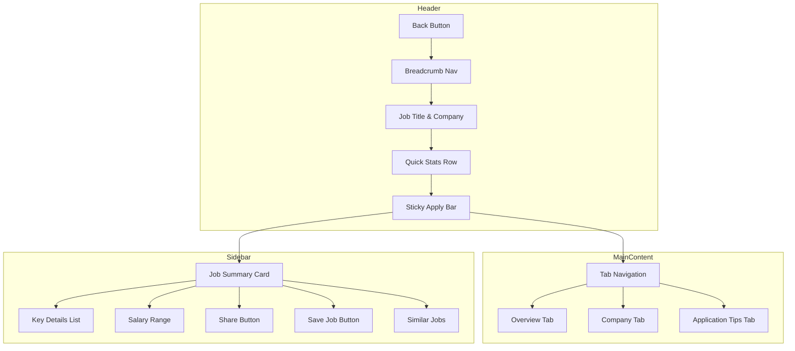

# Job Detail Page UI Redesign Plan

## Overview
Comprehensive redesign of the job single page UI at `src/app/(public)/jobs/[slug]/page.tsx` to create a modern, user-friendly experience with enhanced features and better mobile responsiveness.

---

## Current State Analysis

### Existing Features
- Header with company logo, job title, and Apply button
- Job details (location, salary, job type, experience, deadline)
- Three content sections: Responsibilities, Requirements, Job Description
- Company sidebar card with basic info
- Recent Applications card (for employers)
- Application modal with cover letter and resume fields
- Back navigation to jobs listing

### Pain Points Identified
1. No sticky apply button - users lose access to primary CTA when scrolling
2. Long scrolling required to see all content sections
3. No job sharing capability
4. No "similar jobs" recommendations
5. Mobile experience needs improvement (sidebar takes too much space)
6. No salary insights or market context
7. No application tips for job seekers
8. Loading states could be more refined

---

## Proposed UI Architecture



---

## Implementation Plan

### Phase 1: Core UI Structure

#### 1.1 Sticky Apply Bar
- **Component**: New sticky bottom bar on mobile, sticky sidebar on desktop
- **Features**:
  - Always-visible Apply Now button
  - Shows job title and company briefly
  - Salary range display
  - Save job quick action
- **File**: Modify `src/app/(public)/jobs/[slug]/page.tsx`

#### 1.2 Tabbed Navigation
- **Component**: Use existing Tabs component from `src/components/ui/tabs.tsx`
- **Tabs**:
  1. **Overview** - Responsibilities, Requirements, Description
  2. **Company** - Company details, culture, benefits
  3. **Tips** - Application advice for job seekers
- **Benefits**: Reduces vertical scrolling, organized content

#### 1.3 Improved Header Design
- **Features**:
  - Company logo with fallback icon
  - Job title with verification badge option
  - Quick stats badges (Job Type, Experience Level, Location)
  - Posted date and application deadline
  - Salary range with currency formatting

---

### Phase 2: Enhanced Features

#### 2.1 Job Sharing
- **Component**: New `JobShareButton` component
- **Features**:
  - Copy link to clipboard
  - Share to social media (Twitter, LinkedIn, Facebook)
  - Native Web Share API on supported browsers
- **File**: Create `src/components/job-share-button.tsx`

#### 2.2 Similar Jobs Section
- **Component**: New `SimilarJobs` component
- **Features**:
  - Show 3-5 related jobs based on:
    - Same category/industry
    - Similar job type
    - Same location
  - Horizontal scrollable cards on mobile
  - Grid layout on desktop
- **File**: Create `src/components/jobs/similar-jobs.tsx`
- **API**: May need new endpoint or modify existing `/api/jobs`

#### 2.3 Application Tips Section
- **Component**: New `ApplicationTips` component
- **Content**:
  - How to tailor resume for this role
  - Key skills to highlight
  - Example cover letter structure
  - Common interview questions
- **File**: Create `src/components/jobs/application-tips.tsx`

#### 2.4 Salary Insights Card
- **Component**: Enhanced salary display in sidebar
- **Features**:
  - Salary range visualization
  - Market average comparison (mock data initially)
  - Hourly/monthly/yearly toggle
- **File**: Modify job detail page sidebar

---

### Phase 3: Mobile Optimization

#### 3.1 Responsive Layout Changes
- **Mobile (< 768px)**:
  - Collapsible company card
  - Sticky bottom bar with Apply button
  - Tab navigation becomes horizontal scroll
  - Similar jobs as horizontal scroll
  
- **Desktop (>= 768px)**:
  - Two-column layout maintained
  - Sidebar with sticky behavior
  - Full tab navigation

#### 3.2 Touch-Friendly Interactions
- Larger tap targets (min 44px)
- Swipe gestures for tab navigation
- Pull-to-refresh support

---

### Phase 4: Accessibility & UX Improvements

#### 4.1 Accessibility Enhancements
- ARIA labels on all interactive elements
- Keyboard navigation support
- Focus management for modals
- Screen reader announcements for dynamic content
- Color contrast compliance (WCAG AA)

#### 4.2 Loading States
- **Component**: Refine existing skeleton in `src/components/jobs/JobCardSkeleton.tsx`
- **Features**:
  - Shimmer effect for loading sections
  - Progressive content loading
  - Skeleton for each tab content

#### 4.3 Empty States & Error Handling
- Improved error messages
- Retry actions for failed API calls
- Helpful empty states for no applications

---

## Component File Structure

```
src/
├── components/
│   ├── job-share-button.tsx          [NEW]
│   ├── job-detail-header.tsx         [NEW]
│   ├── job-summary-card.tsx           [NEW]
│   ├── jobs/
│   │   ├── similar-jobs.tsx          [NEW]
│   │   ├── application-tips.tsx      [NEW]
│   │   └── job-card-skeleton.tsx     [EXISTING - enhance]
│   └── ui/
│       └── tabs.tsx                  [EXISTING - use]
├── app/
│   └── (public)/
│       └── jobs/
│           └── [slug]/
│               └── page.tsx          [EXISTING - redesign]
```

---

## API Requirements

### New Endpoint: Similar Jobs
```
GET /api/jobs/similar?jobId={id}&limit=5
```

Response:
```json
{
  "jobs": [
    {
      "id": "...",
      "title": "...",
      "slug": "...",
      "companyName": "...",
      "location": "...",
      "salaryMin": 50000,
      "salaryMax": 70000,
      "jobType": "FULL_TIME"
    }
  ]
}
```

---

## Implementation Priority

| Priority | Task | Estimated Complexity |
|----------|------|---------------------|
| P0 | Sticky apply bar | Medium |
| P0 | Tabbed navigation | Low |
| P0 | Mobile responsiveness | Medium |
| P1 | Job sharing | Low |
| P1 | Similar jobs | Medium |
| P1 | Application tips | Low |
| P2 | Salary insights | Low |
| P2 | Enhanced loading states | Low |

---

## Acceptance Criteria

1. ✅ Job detail page loads within 2 seconds
2. ✅ Apply button always visible while scrolling
3. ✅ All content accessible without excessive scrolling on mobile
4. ✅ Users can share job via multiple channels
5. ✅ Similar jobs displayed when available
6. ✅ Application tips visible for job seekers
7. ✅ Page passes accessibility audit (WCAG AA)
8. ✅ Responsive design works on all screen sizes

---

## Next Steps

Once this plan is approved:
1. Switch to **Code mode** to implement the redesign
2. Start with Phase 1 (Core UI Structure)
3. Progress through phases sequentially
4. Test on multiple devices and browsers
