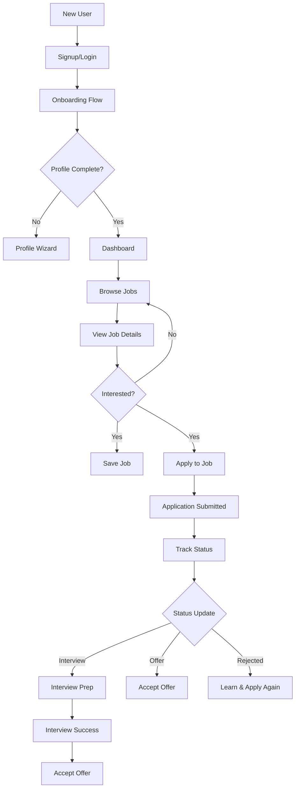
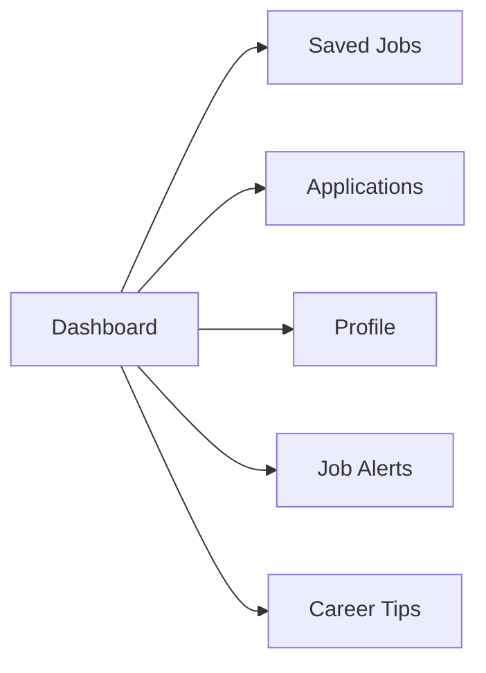
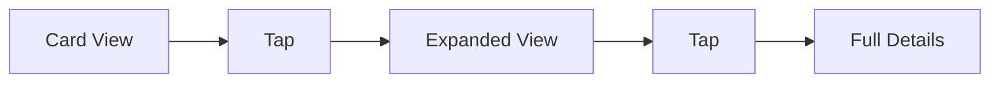

# Job Seeker Flow Design - User-Friendly UI Plan

## Executive Summary

This plan outlines a comprehensive user-friendly flow design for the job seeker journey in HireHub. Building on existing components, we will create an intuitive, mobile-first experience that guides users from job discovery through application submission and interview preparation.

---

## Table of Contents

1. [Current State Assessment](#current-state-assessment)
2. [User Journey Flow](#user-journey-flow)
3. [Page-by-Page Design](#page-by-page-design)
4. [Component Enhancements](#component-enhancements)
5. [User Experience Principles](#user-experience-principles)
6. [Implementation Roadmap](#implementation-roadmap)
7. [Acceptance Criteria](#acceptance-criteria)

---

## Current State Assessment

### ✅ What's Already Implemented

| Component | Status | Location |
|-----------|--------|----------|
| Bottom Navigation | ✅ Complete | `src/components/dashboard/bottom-nav.tsx` |
| Mobile Stats Cards | ✅ Complete | `src/components/dashboard/mobile-stats-card.tsx` |
| Status Filter Chips | ✅ Complete | `src/components/dashboard/status-chip.tsx` |
| Application Cards | ✅ Complete | `src/components/dashboard/application-card.tsx` |
| Mobile Layout | ✅ Complete | `src/app/dashboard/job-seeker/layout.tsx` |
| Dashboard Overview | ✅ Complete | `src/app/dashboard/job-seeker/page.tsx` |
| Applications Page | ✅ Complete | `src/app/dashboard/job-seeker/applications/page.tsx` |
| Saved Jobs Page | ✅ Complete | `src/app/dashboard/job-seeker/saved/page.tsx` |
| Profile Editor | ✅ Complete | `src/app/dashboard/job-seeker/profile/page.tsx` |

### 🎯 Gaps to Address

1. **Onboarding Flow** - No welcome experience for new users
2. **Job Search Integration** - Jobs browsing outside dashboard
3. **Application Timeline** - No visual progress tracking
4. **Interview Preparation** - Missing interview resources
5. **Notification System** - No job alerts
6. **Employer Interactions** - Limited visibility of employer views
7. **Settings Page** - Minimal implementation
8. **Career Resources** - No tips/guides section

---

## User Journey Flow

### Primary User Flows



### Secondary Flows



---

## Page-by-Page Design

### 1. Onboarding Flow (NEW)

**Purpose:** Guide new users through profile setup and introduce key features

**Stages:**
1. **Welcome Screen**
   - Logo and app name
   - Tagline: "Your dream job is just a few clicks away"
   - "Get Started" CTA

2. **Role Selection**
   - "I'm looking for a job" vs "I'm an employer"
   - Clear visual distinction

3. **Profile Basics**
   - Name input
   - Email (prefilled if from auth)
   - Headline/Title (e.g., "Software Engineer")

4. **Job Preferences**
   - Preferred job types (Full-time, Part-time, Remote, etc.)
   - Location preference
   - Expected salary range (optional)

5. **Skill Selection**
   - Quick skill tags
   - Suggestions based on role

6. **Completion**
   - Profile completion percentage
   - "Start Browsing Jobs" CTA

**File:** `src/app/onboarding/` (new directory)

**Components Needed:**
- `OnboardingWizard` - Multi-step form container
- `WelcomeSlide` - Initial welcome screen
- `RoleSelector` - Role selection cards
- `BasicInfoForm` - Name and headline
- `JobPreferencesForm` - Job type and location
- `SkillsSelector` - Skill tags input
- `OnboardingProgress` - Progress indicator

---

### 2. Dashboard Overview (`/dashboard/job-seeker`)

**Current State:** ✅ Complete with stats, quick actions, activity

**Enhancements:**
- Add "Next Step" suggestion card
- Add featured/recommended jobs section
- Add upcoming interview reminders
- Improve empty states with CTAs
- Add quick access to job alerts

**Mockup:**
```
┌─────────────────────────────────────────┐
│  👋 Welcome back, John!       🔔 3 new │
├─────────────────────────────────────────┤
│  ┌──────┐ ┌──────┐ ┌──────┐ ┌──────┐  │
│  │  12  │ │  5   │ │  2   │ │ 85%  │  │
│  │Apps  │ │Saved │ │Inter │ │Prof  │  │
│  └──────┘ └──────┘ └──────┘ └──────┘  │
├─────────────────────────────────────────┤
│  💡 Next Step                            │
│  ─────────────────────────────          │
│  Complete your profile to get more      │
│  visibility with recruiters.             │
│  [Complete Profile]                     │
├─────────────────────────────────────────┤
│  🔥 Recommended for You                 │
│  ┌─────────┐ ┌─────────┐ ┌─────────┐    │
│  │ Frontend│ │ React   │ │ UI Eng │    │
│  │ Dev    │ │ Dev    │ │       │    │
│  └─────────┘ └─────────┘ └─────────┘    │
├─────────────────────────────────────────┤
│  📅 Upcoming                             │
│  • Technical Interview - Tomorrow 2pm   │
├─────────────────────────────────────────┤
│  Quick Actions  [Jobs] [Saved] [Tips]   │
└─────────────────────────────────────────┘
```

---

### 3. Job Search (`/jobs`)

**Current State:** ✅ Functional with filters

**Enhancements:**
- Add "Easy Apply" badge on eligible jobs
- Add company follow feature
- Add salary range filter with slider
- Add "Remote" quick filter
- Add job alert creation from search

**Filter Bar Enhancements:**
```
[Search...] [Location ▼] [Job Type ▼] [Salary ▼] [Remote ✓] [Clear]
```

**Job Card Updates:**
- Add "Easy Apply" button
- Add "Posted recently" badge (< 24h)
- Add "Featured" badge for promoted jobs

---

### 4. Job Detail (`/jobs/[slug]`)

**Current State:** ✅ Comprehensive redesign planned

**Features to Retain:**
- Sticky Apply button
- Tabbed navigation (Overview, Company, Tips)
- Share functionality
- Save job button
- Similar jobs
- Application modal

**Enhancements:**
- Add "Apply with LinkedIn" option
- Add company follow button
- Add salary visualization
- Add application deadline countdown
- Add "What recent hires made" insight

---

### 5. Applications (`/dashboard/job-seeker/applications`)

**Current State:** ✅ Complete with status filters

**Enhancements:**
- Add application timeline view
- Add "Days since applied" indicator
- Add employer response rate
- Add withdraw confirmation modal
- Add application notes (personal)
- Add "Request reference" for offers

**Timeline View:**
```
Applied → Viewed → Interview → Offer
   │        │         │         │
  5d       3d        1d        -
```

**Status Card Design:**
```
┌─────────────────────────────────────────┐
│  🏢 TechCorp                    📅 5d   │
│  Senior Frontend Developer     ─────────│
│  San Francisco, CA            [VIEW]   │
│  ───────────────────────────────────── │
│  [Pending] [•••]                        │
│                                         │
│  📝 Your Notes:                        │
│  "Followed up on LinkedIn..."          │
└─────────────────────────────────────────┘
```

---

### 6. Saved Jobs (`/dashboard/job-seeker/saved`)

**Current State:** ✅ Grid/List view with search

**Enhancements:**
- Add folder/category organization
- Add "Expires soon" warnings
- Add one-click apply from saved
- Add "In applied" filter
- Add sort options (Date saved, Salary, Deadline)

**Folder System:**
```
📁 All Saved (12)
📁 Applied (5)
📁 Interviewing (2)
📁 Interviews (1)
// Click to expand
```

---

### 7. Profile (`/dashboard/job-seeker/profile`)

**Current State:** ✅ Functional editor

**Enhancements:**
- Create step-by-step wizard
- Add progress persistence
- Add "Preview as Employer" toggle
- Add profile strength score
- Add completion checklist
- Add import from LinkedIn option
- Add multiple resume uploads

**Wizard Structure:**
```
Step 1: 👤 Basic Info  [████████░░] 80%
Step 2: 📧 Contact
Step 3: 💼 Experience  
Step 4: 🎓 Education
Step 5: 🛠 Skills
Step 6: 📎 Documents
Step 7: 📸 Photo
```

**Validation Rules:**

| Field | Required | Validation |
|-------|----------|------------|
| Full Name | ✅ | Min 2 characters |
| Headline | ✅ | Max 100 chars |
| Email | ✅ | Valid format |
| Phone | ❌ | Valid format if provided |
| Location | ✅ | - |
| Experience | ❌ | At least 1 recommended |
| Education | ❌ | - |
| Skills | ✅ | Min 3 recommended |
| Resume | ❌ | PDF, DOC, DOCX, Max 5MB |

---

### 8. Career Tips (`/dashboard/job-seeker/tips` - NEW)

**Purpose:** Provide resources to help job seekers succeed

**Sections:**
1. **Resume Tips**
   - How to format
   - What to include
   - Common mistakes

2. **Interview Prep**
   - Common questions
   - Body language tips
   - What to wear

3. **Salary Negotiation**
   - When to negotiate
   - How to research
   - Tips for success

4. **Job Search Strategies**
   - Where to find jobs
   - Networking tips
   - Using LinkedIn effectively

**File:** `src/app/dashboard/job-seeker/tips/page.tsx`

---

### 9. Job Alerts (`/dashboard/job-seeker/alerts` - NEW)

**Purpose:** Notify users of matching jobs

**Features:**
- Create alert from job search
- Set frequency (Daily, Weekly, Instant)
- Manage existing alerts
- View matched jobs

**Alert Creation:**
```
┌─────────────────────────────────────────┐
│  Create Job Alert                       │
│  ─────────────────────────────          │
│  Keywords: [Frontend Developer    ]     │
│  Location: [San Francisco       ]        │
│  Job Type: [▼ Full-time        ]        │
│  Salary:   [$80k - $120k       ]        │
│  Frequency: (○ Daily  ● Weekly)          │
│                                         │
│          [Create Alert]                 │
└─────────────────────────────────────────┘
```

**File:** `src/app/dashboard/job-seeker/alerts/page.tsx`

---

### 10. Settings (`/dashboard/job-seeker/settings`)

**Current State:** ⚠️ Minimal implementation

**Enhancements:**
- Account settings (email, password)
- Notification preferences
- Privacy settings
- Connected accounts
- Delete account
- Language/Region

---

## Component Enhancements

### 1. Enhanced Stats Card

```tsx
interface EnhancedStatsCardProps {
  label: string;
  value: number | string;
  icon: LucideIcon;
  trend?: "up" | "down" | "neutral";
  trendValue?: string;
  color: "blue" | "emerald" | "purple" | "orange";
  onClick?: () => void;
  badge?: string;
}
```

**Features:**
- Animated number counter
- Trend indicator
- Click to navigate
- Badge for alerts

---

### 2. Application Timeline

```tsx
interface ApplicationTimelineProps {
  application: Application;
  events: TimelineEvent[];
}
```

**Events:**
- Application Submitted
- Employer Viewed
- Application Under Review
- Interview Scheduled
- Offer Received
- Rejected

---

### 3. Job Alert Card

```tsx
interface JobAlertCardProps {
  alert: JobAlert;
  matchCount: number;
  onEdit: () => void;
  onDelete: () => void;
}
```

---

### 4. Profile Completion Widget

```tsx
interface ProfileCompletionProps {
  percentage: number;
  missingFields: string[];
  onComplete: () => void;
}
```

---

### 5. Empty State Component

```tsx
interface EmptyStateProps {
  icon: LucideIcon;
  title: string;
  description: string;
  action?: {
    label: string;
    href: string;
  };
}
```

**Usage:**
- No applications
- No saved jobs
- No profile
- No search results

---

## User Experience Principles

### 1. Progressive Disclosure

Show only what's necessary initially, reveal details on demand.



### 2. Instant Feedback

All actions should provide immediate visual feedback.

| Action | Feedback |
|--------|----------|
| Save Job | Toast + Icon change |
| Apply | Modal confirmation |
| Submit Form | Loading + Success |
| Error | Inline message |

### 3. Contextual Help

Add tooltips and hints where needed.

```tsx
// Example: Salary field hint
<Input 
  label="Expected Salary" 
  placeholder="e.g., 50000"
  hint="Enter annual salary in USD"
/>
```

### 4. Consistent Navigation

Maintain predictable navigation patterns.

- Bottom nav: 4 tabs (Home, Applied, Saved, Profile)
- Top nav: Logo + Search + Profile menu
- Back navigation: Always available

### 5. Accessibility

- Minimum touch target: 44px
- Color contrast: WCAG AA
- Screen reader support
- Keyboard navigation

---

## Implementation Roadmap

### Phase 1: Core Experience (Week 1-2)

| Task | Priority | Complexity |
|------|----------|------------|
| Onboarding Flow | P0 | High |
| Dashboard Enhancements | P0 | Medium |
| Enhanced Empty States | P1 | Low |
| Profile Wizard | P1 | Medium |

### Phase 2: Engagement (Week 3-4)

| Task | Priority | Complexity |
|------|----------|------------|
| Job Alerts System | P0 | Medium |
| Career Tips Page | P1 | Low |
| Application Timeline | P1 | Medium |
| Settings Page | P2 | Medium |

### Phase 3:Polish (Week 5-6)

| Task | Priority | Complexity |
|------|----------|------------|
| Animations | P2 | Low |
| Performance | P2 | Medium |
| Testing | P1 | Medium |
| Documentation | P2 | Low |

---

## File Structure

```
src/
├── app/
│   ├── (public)/
│   │   └── jobs/
│   │       └── [slug]/
│   │           └── page.tsx          [EXISTING]
│   ├── dashboard/
│   │   └── job-seeker/
│   │       ├── layout.tsx             [EXISTING]
│   │       ├── page.tsx              [EXISTING - enhance]
│   │       ├── applications/
│   │       │   └── page.tsx          [EXISTING - enhance]
│   │       ├── saved/
│   │       │   └── page.tsx          [EXISTING - enhance]
│   │       ├── profile/
│   │       │   └── page.tsx          [EXISTING - enhance]
│   │       ├── settings/
│   │       │   └── page.tsx          [EXISTING - enhance]
│   │       ├── tips/                 [NEW]
│   │       │   └── page.tsx
│   │       └── alerts/               [NEW]
│   │           └── page.tsx
│   └── onboarding/                   [NEW]
│       ├── page.tsx
│       └── layout.tsx
├── components/
│   ├── dashboard/
│   │   ├── bottom-nav.tsx            [EXISTING]
│   │   ├── mobile-stats-card.tsx     [EXISTING]
│   │   ├── application-card.tsx      [EXISTING]
│   │   ├── status-chip.tsx           [EXISTING]
│   │   ├── application-timeline.tsx [NEW]
│   │   ├── job-alert-card.tsx        [NEW]
│   │   ├── profile-widget.tsx        [NEW]
│   │   └── empty-state.tsx           [NEW]
│   ├── onboarding/                   [NEW]
│   │   ├── welcome-slide.tsx
│   │   ├── role-selector.tsx
│   │   ├── basic-info-form.tsx
│   │   ├── job-preferences-form.tsx
│   │   ├── skills-selector.tsx
│   │   └── progress-stepper.tsx
│   └── ui/
│       └── ...                       [EXISTING]
```

---

## API Requirements

### New Endpoints Needed

1. **Onboarding**
   ```
   POST /api/onboarding/complete
   Body: { profileData, preferences }
   ```

2. **Job Alerts**
   ```
   GET /api/job-alerts
   POST /api/job-alerts
   PUT /api/job-alerts/[id]
   DELETE /api/job-alerts/[id]
   ```

3. **Application Stats**
   ```
   GET /api/applications/stats
   Returns: { total, byStatus, responseRate, avgTimeToResponse }
   ```

4. **Profile Completion**
   ```
   GET /api/profile/completion
   Returns: { percentage, missingFields, suggestions }
   ```

5. **Recommended Jobs**
   ```
   GET /api/jobs/recommended
   Returns: Job[] based on profile and preferences
   ```

---

## Acceptance Criteria

### Onboarding
- [ ] New users see onboarding flow after signup
- [ ] Profile data persists correctly
- [ ] Users can skip onboarding
- [ ] Mobile-responsive on all steps

### Dashboard
- [ ] Stats load within 1 second
- [ ] Quick actions navigate correctly
- [ ] Empty states show appropriate CTAs
- [ ] Profile completion widget shows accurate data

### Job Search
- [ ] Filters work correctly
- [ ] Search returns relevant results
- [ ] Save/unsave works
- [ ] Application submission works

### Applications
- [ ] Status filters show correct counts
- [ ] Timeline displays correctly
- [ ] Withdraw function works with confirmation
- [ ] Notes can be added/edited

### Saved Jobs
- [ ] Jobs can be saved/unsaved
- [ ] Grid/list toggle works
- [ ] Sorting works correctly
- [ ] One-click apply from saved works

### Profile
- [ ] All sections editable
- [ ] Validation works correctly
- [ ] Preview mode displays correctly
- [ ] Resume upload works

### Settings
- [ ] All settings editable
- [ ] Changes persist correctly
- [ ] Delete account works with confirmation

---

## Success Metrics

| Metric | Target |
|--------|--------|
| Profile Completion Rate | > 80% |
| Application Rate | > 60% |
| Onboarding Completion | > 90% |
| Dashboard Engagement | > 70% daily |
| Job Alerts Usage | > 40% |
| Career Tips Views | > 30% |

---

## Next Steps

1. **Approve this plan**
2. Create onboarding components
3. Update dashboard with enhancements
4. Build job alerts system
5. Add career tips page
6. Enhance settings page

---

*Document Version: 1.0*  
*Last Updated: 2026-03-22*  
*Plan Type: UI/UX Design*